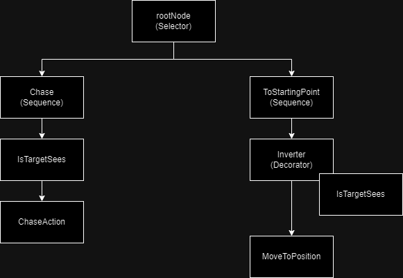

# Behavior Tree for Unity 3D
>ENG: A simple example of implementing behavior tree for opponents in your game.
____

## What is Behavior Tree? / Что такое дерево поведения (решений)?

Behavior tree — a mathematical model of plan execution used in computer science, robotics, control systems and video games. They describe switchings between a finite set of tasks in a modular fashion. Their strength comes from their ability to create very complex tasks composed of simple tasks, without worrying how the simple tasks are implemented. Behavior trees present some similarities to hierarchical state machines with the key difference that the main building block of a behavior is a task rather than a state. Its ease of human understanding make behavior trees less error prone and very popular in the game developer community. Behavior trees have been shown to generalize several other control architectures.

#### In simple words, this means

This is a set of actions and conditions before these actions combined into some tree-like format that determines which of the actions to be performed. An example will be below.

We have some object that will perform actions:

  - Chase the player if he sees him
  - Return to the starting point if you lost a player

We can distinguish two branches of behavior of the same name from this: pursue and go back

Chase

What should be checked before pursuing? Well, probably what we see is the object of persecution. If not, then this branch of behavior does not make sense.

Return to starting point

What should be checked before returning? Well, probably that we don't see the object anymore, otherwise it would be strange that we went to the starting point.

It turns out that our behavior tree should look something like this:

